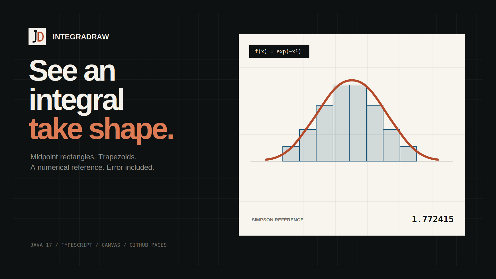

<div align="center">
  

# IntegraDraw

**A visual calculus workbench for comparing numerical integration methods.**

[Live workbench](https://ejupi-djenis30.github.io/IntegraDraw/) · [Watch the demo](web/public/integradraw-demo.mp4) · [Desktop build](#desktop-application) · [Architecture](#architecture) · [Credits](#credits)

<br>


</div>

## What it does

IntegraDraw turns a definite integral into something you can inspect. Enter a function and interval, choose the number of segments, then compare:

- the midpoint rectangle sum;
- the trapezoidal sum;
- a high-resolution Simpson reference;
- the absolute error of each approximation.

The repository contains two working implementations of the same idea:

- a Java 17 desktop application, rebuilt without IntelliJ GUI-form instrumentation;
- a responsive TypeScript and Canvas application deployed through GitHub Pages.

Both keep signed area signed, use exactly the requested number of intervals and reject invalid inputs explicitly.

## Live web workbench

The Page runs entirely in the browser. It has no account system, backend, analytics or remote expression evaluator.

```bash
cd web
npm install
npm run dev
```

Quality checks and production build:

```bash
npm run check
npm run build
```

The expression engine is intentionally small. It supports `x`, `pi`, `e`, arithmetic operators, parentheses and these functions:

```text
sin cos tan exp ln log sqrt abs
```

It does not use `eval` or `Function`.

## Desktop application

Requirements: JDK 17+ and Maven 3.9+.

```bash
mvn clean verify
java -jar target/integradraw-1.1.0.jar
```

The packaged JAR includes the Symja dependencies and has a valid entry point. The Swing UI is created in Java code, so it runs from Maven, an IDE or the JAR without IntelliJ’s `.form` compiler.

## Architecture

```text
IntegraDraw/
├── src/main/java/             Java desktop application
│   └── com/planck/math/       Parsing and numerical methods
├── src/test/java/             JUnit regression tests
├── web/
│   ├── src/math/              Dependency-free expression and integration core
│   ├── src/plot.ts            Responsive Canvas renderer
│   ├── src/main.ts            Workbench controller
│   └── public/                Brand assets, poster and the 1280×720 demo
├── scripts/render-demo.py     Reproducible video compositor
├── docs/video-storyboard.md   Reproducible capture states for the demo video
└── .github/workflows/         Java/web CI and Pages deployment
```

The Java and TypeScript implementations are separate on purpose. Their tests express the same invariants without coupling a browser build to the desktop runtime.

## Mathematical scope

The midpoint and trapezoidal values are numerical approximations. The browser’s comparison value uses composite Simpson’s rule with 8,192 subintervals; the desktop uses the same method at a lower interactive resolution. The UI calls this a **reference**, not an exact result.

Functions with discontinuities or non-finite values may be rejected. IntegraDraw is an exploratory teaching tool, not a computer algebra proof system.

## Automated checks

Pull requests and pushes run:

- Java 17 compilation, the JUnit regression suite and executable JAR packaging;
- strict TypeScript checking;
- expression-parser and integration tests;
- the production Pages build.

Each successful Java run publishes a short-lived build artifact containing the executable JAR, SHA-256 checksums and a CycloneDX SBOM. Dependabot monitors Maven, npm and GitHub Actions dependencies each month.

## Product demo

The repository includes a 10-second, 1280×720 product demonstration built from real browser captures:

- [`web/public/integradraw-demo.mp4`](web/public/integradraw-demo.mp4)
- [`web/public/poster.svg`](web/public/poster.svg)
- [`docs/video-storyboard.md`](docs/video-storyboard.md)

It moves from the hero to an eight-segment approximation, shows convergence at 160 segments and closes with the responsive mobile controls and graph. The storyboard keeps the longer capture plan reproducible.

## Contributing and security

Read [CONTRIBUTING.md](CONTRIBUTING.md) before proposing a change and check
[CHANGELOG.md](CHANGELOG.md) for the current project record. Report suspected vulnerabilities
privately through [SECURITY.md](SECURITY.md), not through a public issue.

## Credits

IntegraDraw started as a collaborative school project in 2023.

- **Djenis Ejupi** — original implementation and current modernization.
- **`NobodyToListen`** — original Java implementation and UI/mathematics contributions.

The original Git history and the legacy IntelliJ `.form` file remain in the repository so earlier work stays attributable. The current runtime no longer depends on that file.

No license has been added during this modernization. Reuse rights must be agreed with the original contributors before a license is selected.
