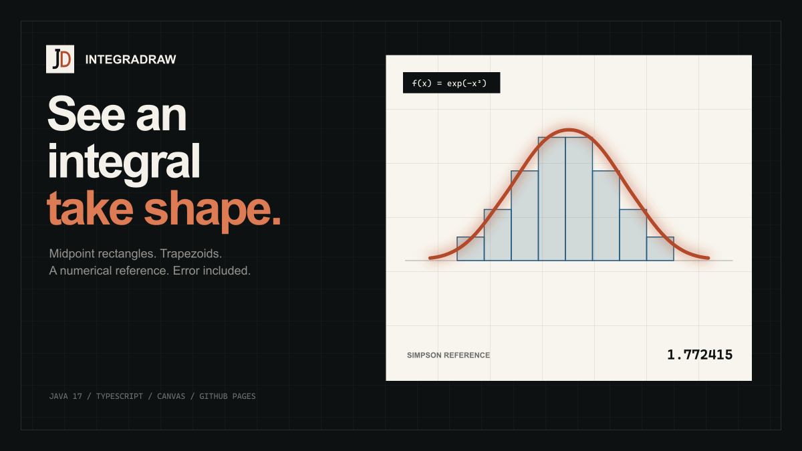

<div align="center">
  

# IntegraDraw

**A visual calculus workbench for comparing numerical integration methods.**

[Live workbench](https://ejupi-djenis30.github.io/IntegraDraw/) · [Desktop build](#desktop-application) · [Architecture](#architecture) · [MIT License](LICENSE) · [Support](SUPPORT.md) · [Credits](#credits)

<br>


</div>

## What it does

IntegraDraw turns a definite integral into something you can inspect. Enter a function and interval, choose the number of segments, then compare:

- the midpoint rectangle sum;
- the trapezoidal sum;
- a high-resolution Simpson reference;
- the absolute error of each approximation.

The repository contains two working implementations of the same idea:

- a Java 17 desktop application, rebuilt without IntelliJ GUI-form instrumentation;
- a responsive TypeScript and Canvas application deployed through GitHub Pages.

Both keep signed area signed, use exactly the requested number of intervals and reject invalid inputs explicitly.

## Live web workbench

The Page runs entirely in the browser. It has no account system, backend, analytics or remote expression evaluator.

```bash
cd web
npm install
npm run dev
```

Quality checks and production build:

```bash
npm run check
npm run build
```

The expression engine is intentionally small. It supports `x`, `pi`, `e`, arithmetic operators, parentheses and these functions:

```text
sin cos tan exp ln log sqrt abs
```

It does not use `eval` or `Function`.

## Desktop application

Requirements: JDK 17 and Maven 3.9.16. The included Maven wrapper supplies the exact Maven version.

```bash
./mvnw clean verify
java -jar target/integradraw-1.1.0.jar
```

The packaged JAR includes the Symja dependencies and has a valid entry point. The Swing UI is created in Java code, so it runs from Maven, an IDE or the JAR without IntelliJ’s `.form` compiler.

## Architecture

```text
IntegraDraw/
├── src/main/java/             Java desktop application
│   └── com/planck/math/       Parsing and numerical methods
├── src/test/java/             JUnit regression tests
├── web/
│   ├── src/math/              Dependency-free expression and integration core
│   ├── src/plot.ts            Responsive Canvas renderer
│   ├── src/main.ts            Workbench controller
│   └── public/                Brand assets and social preview
└── .github/workflows/         Java/web CI and Pages deployment
```

The Java and TypeScript implementations are separate on purpose. Their tests express the same invariants without coupling a browser build to the desktop runtime.

## Mathematical scope

The midpoint and trapezoidal values are numerical approximations. The browser’s comparison value uses composite Simpson’s rule with 8,192 subintervals; the desktop uses the same method at a lower interactive resolution. The UI calls this a **reference**, not an exact result.

Functions with discontinuities or non-finite values may be rejected. IntegraDraw is an exploratory teaching tool, not a computer algebra proof system.

## Automated checks

Pull requests and pushes run:

- Java 17 compilation, the JUnit regression suite and executable JAR packaging;
- strict TypeScript checking;
- expression-parser and integration tests;
- release-metadata and static-site validation;
- the production Pages build.

Each successful Java run publishes a short-lived build artifact containing the executable JAR and its CycloneDX SBOM. Release candidates add normalized SBOMs and the consolidated SHA-256 inventory described below. Dependabot monitors Maven, npm and GitHub Actions dependencies each month.

## Release process

The release workflow runs the same candidate builder on pull requests, manual dispatches and `v*` tag pushes. Pull requests and manual runs can inspect the complete output, but they cannot publish a release. A manual run can also supply an optional stable `v<version>` value to exercise the exact tag validator safely.

Before a tag can publish, the workflow requires:

- a stable `MAJOR.MINOR.PATCH` version with no prerelease or build suffix;
- the version in `pom.xml` and `web/package.json` to match;
- the npm lockfile to carry the same project version;
- one visible, dated Markdown heading for that version in `CHANGELOG.md`;
- a tag named exactly `v<version>`;
- the tagged commit to belong to the default branch;
- pinned Temurin 17, Node.js and Maven toolchains;
- Java tests, packaging, manifest inspection and a real `java -jar … --version` smoke test;
- web typechecking, tests, validation and a production build;
- semantic ZIP, CycloneDX and complete dependency-graph validation;
- normalized Java and web CycloneDX SBOMs reconciled exactly with independently generated dependency inventories;
- one source-commit record and one consolidated, verified `SHA256SUMS` file.

Two separate jobs then gate publication. The vulnerability job audits the npm lock and scans the source manifests plus both exact candidate SBOMs with Trivy, failing on medium, high or critical findings. The reproducibility job starts from another clean checkout, rebuilds the JAR, static ZIP and normalized SBOMs, and compares the entire candidate byte for byte.

Only a tag run that passes both gates can reach publication. The tag-only job attests every asset, including `SHA256SUMS`, and independently verifies the signer, workflow, commit, ref, predicate and GitHub-hosted runner before upload. The publisher keeps one contract-bound draft that can survive an interrupted run, verifies the protected tag and default-branch ancestry again, compares every remote name, size and digest, then confirms the public release is immutable and latest. Reruns accept only that exact draft or the exact immutable release; they never overwrite a published release.

Run the metadata and bundle-validator tests locally with:

```bash
cd web
npm ci
npm run check
```

The release validator, deterministic ZIP writer, artifact parsers, inventory comparison and publication state machine are dependency-free Node.js modules covered by negative tests. The Maven wrapper pins Maven 3.9.16 and verifies the downloaded distribution checksum.

No release tag is created by repository automation. The original contributors approved the MIT License, so publication is enabled; the workflow still verifies the exact license text before it can publish. A maintainer must create a signed `v1.1.0` tag on the reviewed default-branch commit to start the trusted release path.

## Contributing and security

Read [CONTRIBUTING.md](CONTRIBUTING.md) before proposing a change and check
[CHANGELOG.md](CHANGELOG.md) for the current project record. Report suspected vulnerabilities
privately through [SECURITY.md](SECURITY.md), not through a public issue.

## Credits

IntegraDraw started as a collaborative school project in 2023.

- **Djenis Ejupi** — original implementation and current modernization.
- **`project contributors`** — original Java implementation and UI/mathematics contributions.

The original Git history and the legacy IntelliJ `.form` file remain in the repository so earlier work stays attributable. The current runtime no longer depends on that file.

IntegraDraw is available under the [MIT License](LICENSE). Copyright remains with Djenis Ejupi and `project contributors`.
